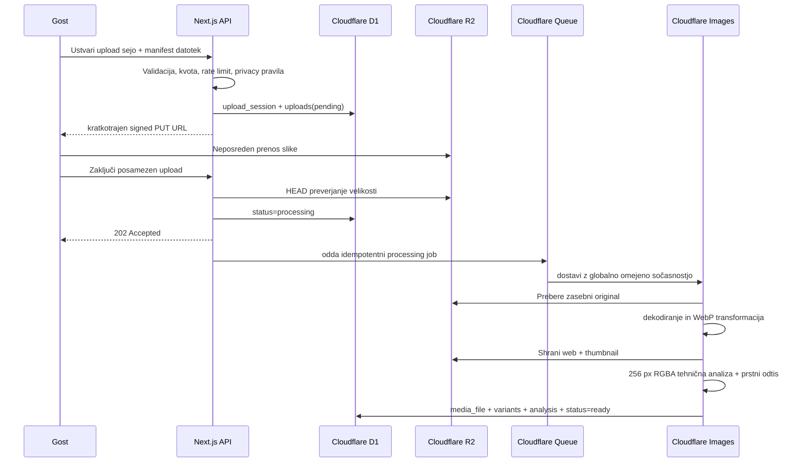

# Arhitektura

## Izbrani pristop

Za prvi slikovni MVP velja [ADR-004](decisions/ADR-004-cloudflare-platform.md). Sistem je modularni monolit na Cloudflare platformi s petimi Worker površinami:

1. `web`: Next.js App Router prek OpenNext za javne strani, dashboard in Route Handlerje;
2. `retention`: majhen scheduled Worker za dnevni fizični izbris;
3. `exports`: Queue consumer za pretočne ZIP izvoze;
4. `quality`: Queue producer/consumer za masovni tehnični backfill;
5. `media-processing`: Queue consumer za variante in tehnično analizo novih slik;
6. `face-processing`: Queue consumer za dogodkovno omejeno indeksiranje obrazov,
   ephemeral selfie search in fizični cleanup biometričnih referenc.

Metapodatki so v D1, zasebni originali ter spletne variante v R2. Cloudflare Images binding iz originala izdela očiščen WebP in thumbnail. Redis/BullMQ ter dolgoročen Node.js worker niso del prvega slikovnega MVP-ja.

Face processing sledi [ADR-010](decisions/ADR-010-ephemeral-face-search.md).
Brskalnik naloži največ 5 MB JPEG/PNG selfie neposredno v začasni zasebni R2
prefix. Web zapiše verzionirano soglasje in odda samo opaque ID-je v Queue.
Worker pretvori dogodkovne fotografije v začasni JPEG za ponudnika, indeksira
jih v collection posameznega dogodka in po iskanju vedno izbriše selfie. Domena
pozna samo `FaceProvider`; prvi adapter je AWS Rekognition v konfigurirani EU
regiji, poverilnice pa obstajajo samo v face workerju.

## Predlagani moduli

| Modul | Odgovornost |
| --- | --- |
| identity | prijava, seje, vloge in članstvo v organizaciji |
| organizations | tenant meja in naročniki |
| events | življenjski cikel dogodka, nastavitve in upravičenja |
| access | QR/NFC točke, preusmeritve, attribution in obiski |
| uploads | upload seje, signed URL-ji, kvote in zaključevanje |
| media | metapodatki, variante, moderacija in galerija |
| processing | queue opravila, thumbnaili, EXIF, video in checksum |
| exports | ZIP ter časovno omejeni prenosi |
| slideshow | playlist, dovoljenja in real-time dogodki |
| ai | ponudniško neodvisni ukazi ter rezultati analiz |
| notifications | e-pošta in in-app obvestila |
| compliance | soglasja, hramba, izbris in audit |
| billing | paketi, dodatki, cene in upravičenja |

Moduli komunicirajo prek funkcij use-case in domenskih dogodkov. Ne uvažajo notranjih repositoryjev drugih modulov.

## Next.js poti

```text
app/
  (public)/e/[slug]/              # javna stran, upload in galerija
  (public)/t/[code]/              # stabilna QR/NFC preusmeritev
  (auth)/login/                   # prijava osebja
  (dashboard)/admin/              # platform admin
  (dashboard)/events/[eventId]/   # upravljanje dogodka
  display/[token]/                # zaščiten slideshow (faza 2)
  api/v1/                         # javni in partnerski HTTP API
  api/internal/                   # webhooki in notranji callbacki
```

Route groups so predstavitvena struktura. Poslovna pravila živijo v `packages/domain` oziroma strežniških feature modulih.

## Tok uploada



### Pravila uploada

- podpis velja kratek čas in dovoljuje le določen object key ter velikost;
- object key temelji na internem UUID, ne na originalnem imenu;
- originalno ime je očiščeno in je le metapodatek;
- odjemalčev MIME je namig, worker preveri magic bytes;
- dogodek, seja in vsaka datoteka imajo kvoto ter rate limit;
- zaključek in processing job sta idempotentna;
- zapuščeni pending zapisi in objekti se periodično očistijo;
- status se spreminja s compare-and-set, da retry ne vrne stanja nazaj.

### Tehnična analiza kakovosti

Prvi rez faze 3 ostane brez zunanjega AI ponudnika. Processing pretočno izračuna SHA-256 originala, Cloudflare Images pa poleg galerijskih različic izdela 256 × 256 RGBA analizni vzorec. Čiste domenske funkcije iz njega izračunajo osvetlitev, ostrino in 64-bitni difference hash. Primerjava duplikatov je omejena na `organization_id` in dogodek; datoteka se samo označi in se nikoli samodejno ne izbriše. Različica algoritma je shranjena ob vsakem rezultatu, da je poznejši backfill ponovljiv.

Napaka dodatne kakovostne analize ne spremeni uspešno obdelane fotografije v `rejected`; zapiše se ločen neuspešen analysis rezultat, ki ga je mogoče varno ponoviti iz administratorske galerije. Ročni override ne prepiše rezultata algoritma: hrani se ločeno, z identiteto urednika in audit dogodkom, ter ga je mogoče odstraniti. Masovni backfill poteka prek namenske Cloudflare Queue. Obdelava novih medijev prav tako uporablja ločeno Queue po [ADR-009](decisions/ADR-009-media-processing-queue.md); spletni `waitUntil` ni izvajalec transformacij novih uploadov. En začetni quality job se razveji v pakete po največ 100 sporočil. `quality_backfill_items` zagotavlja idempotentno štetje ob at-least-once dostavi, tri poskuse z zamikom in vidno delno napako.

Po [ADR-006](decisions/ADR-006-quality-publication-gate.md) sta javna galerija in slideshow fail-closed: prikažeta samo efektivni kategoriji `best` in `good`. Slabše, podvojene in še neanalizirane fotografije ostanejo v administratorski galeriji in se nikoli samodejno ne izbrišejo.

## Shranjevanje

Predlagana logična struktura bucketov/prefixov:

```text
private-originals/{organizationId}/{eventId}/{mediaId}/original
private-derived/{organizationId}/{eventId}/{mediaId}/{variant}
temporary/{uploadSessionId}/{uploadId}
exports/{organizationId}/{eventId}/{exportId}.zip
```

Originali so vedno zasebni. Javne variante se dostavljajo prek podpisanih CDN URL-jev ali preverjene image delivery poti. Imena bucketov so konfiguracija okolja.

## Cache in real-time

- Redis se uporablja za queue, rate limiting in kratke cache ključe, ne kot vir resnice.
- V MVP galerija uporablja revalidation oziroma polling po uspešnem uploadu.
- Faza 2 uvede `RealtimePublisher` adapter (Pusher/Ably/Supabase ali SSE na primernem hostingu).
- Sporočilo vsebuje le ID in tip dogodka; odjemalec nato pridobi avtorizirano stanje iz API-ja.

## Avtentikacija in avtorizacija

- Javni Stripe nakup ne ustvari identitete ali seje; kontaktna e-pošta je namenjena dostavi QR in ZIP.
- Plačan webhook ustvari stranko in dogodek v interni organizaciji `eventaj`.
- Seja identificira uporabnika, avtorizacijska storitev pa preveri članstvo, vlogo, organizacijo in po potrebi dogodek.
- Platform admin je ločena globalna sposobnost, ne članstvo v vsaki organizaciji.
- Javni slideshow uporablja preklicljiv, rotirajoč, hashiran token.

## Plačilni tok

Gostovani Stripe Checkout prejme 35 EUR za dogodek in opcijskih 15 EUR za AI
Best Photos. Aplikacija v Stripe metadata pošlje samo ID lokalnega naročila.
Podpisan webhook in success stran kličeta isto idempotentno fulfillment funkcijo,
ki ponovno pridobi Checkout Session ter preveri plačilo, znesek in valuto.
Po uspehu Queue pošlje QR e-pošto. Scheduled export worker po `ends_at` izdela ZIP
in pošlje drugo e-pošto z hashirano, časovno omejeno bearer povezavo.

## Deployment topologija

Priporočena začetna topologija:

- Next.js web na platformi z dobro podporo za App Router;
- worker na long-running container hostingu;
- upravljani PostgreSQL z EU regijo in PITR;
- upravljani Redis z vztrajnostjo, primerno za queue;
- R2/S3 bucket in CDN v EU-kompatibilni konfiguraciji;
- ločena okolja `local`, `preview`, `staging`, `production`.

Ponudniki ostanejo odprta odločitev. Preview okolja ne smejo uporabljati produkcijskih osebnih podatkov.

## Opazljivost

- strukturirani JSON logi z `requestId`, `jobId`, `eventId` in brez PII;
- error tracking za web in worker;
- metrike: upload success rate, processing latency, queue depth, failed jobs, storage bytes, signed URL failures;
- health endpoints za web, DB, Redis in worker heartbeat;
- alarm za naraščajočo dead-letter vrsto ter neuspešno brisanje ob poteku hrambe.
