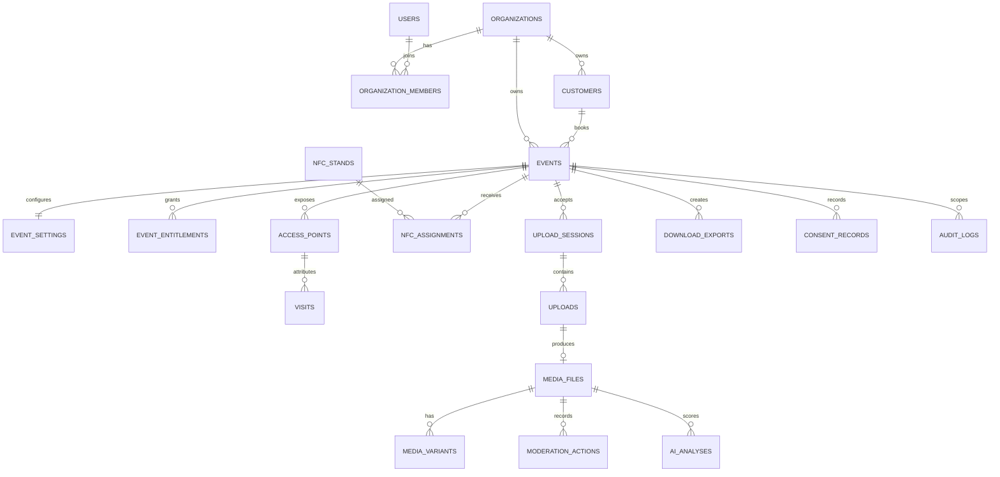
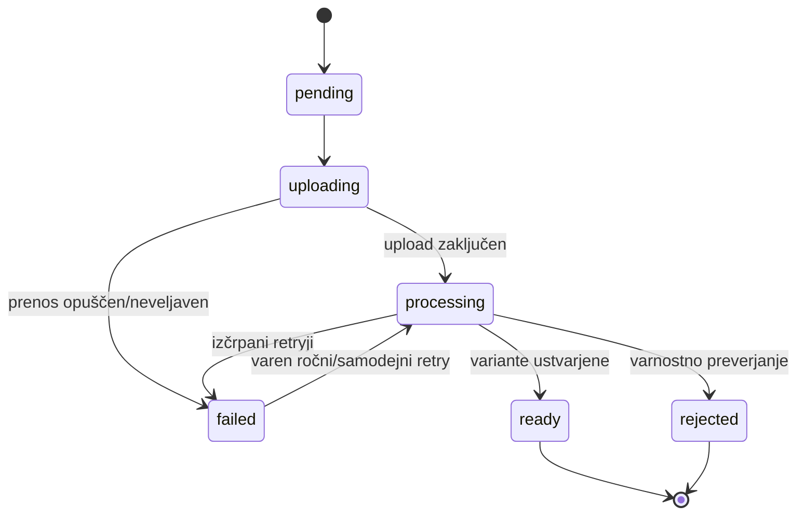

# Podatkovni model

Opomba: spodnji razširjeni model ostaja cilj poznejših faz. Cloudflare MVP po [ADR-004](decisions/ADR-004-cloudflare-platform.md) uporablja D1 migracije `migrations/0001_initial.sql`–`migrations/0009_quality_backfills.sql`. Migracija 0002 je povratno združljiva: obstoječe upload seje imajo `access_point_id = NULL`. Migracija 0003 doda tenant ključ dogodkom in obstoječe vrstice povratno združljivo pripiše prvotnemu delovnemu prostoru `eventaj`; vsi novi administratorski read/write dostopi ga morajo filtrirati. Migracija 0004 doda stranke, katalog paketov ter neobvezna tuja ključa na obstoječe dogodke. Migracija 0005 doda ločeno `slideshow_state` z odobrenim privzetim stanjem za obstoječe fotografije ter tabelo `slideshows`; javni token se hrani izključno kot SHA-256 hash. Migracija 0006 doda kratkotrajne ZIP izvoze; vsebujejo le izpeljane galerijske WebP datoteke, ZIP objekt pa retention worker fizično izbriše po poteku. Migracija 0007 povratno združljivo doda nullable tehnične metrike, prstne odtise in `ai_analyses`; obstoječi mediji ostanejo nespremenjeni do eksplicitnega backfilla. Migracija 0008 doda nullable ročni override, identiteto urednika in čas spremembe; `NULL` še naprej pomeni uporabo samodejne kategorije. Migracija 0009 doda jobe in idempotentne postavke masovnega backfilla brez spremembe obstoječih analiz. Ker je administrator samo eden, njegova identiteta in hash gesla živita v Cloudflare secret konfiguraciji, ne v tabeli uporabnikov.

## Splošna pravila

- Primarni ključi so UUID/UUIDv7 ali CUID2; javni identifikatorji so ločeni in nepredvidljivi.
- Vse tenant entitete imajo `organization_id` in ustrezne sestavljene indekse.
- Časi so ISO 8601 UTC besedilo v D1; dogodek ima IANA `timezone`.
- Cene so `amount_cents integer` + `currency char(3)`.
- Fleksibilen JSON je dovoljen za ponudniške rezultate in redke nastavitve, ne za ključna poslovna pravila.
- Statusi so aplikacijsko definirani enum-i s CHECK omejitvami.

## Jedrni model

## Tabele in ključna polja

### Identiteta in tenancy

- `users`: id, email, email_verified_at, name, status, created_at.
- `organizations`: id, public_id, name, slug, status, billing_email, created_at.
- `organization_members`: organization_id, user_id, role, status, invited_at, joined_at; unique `(organization_id, user_id)`.
- `customers`: id, organization_id, name, email, phone, billing_data_encrypted, created_at.

### Paketi in upravičenja

- `packages`: id, code, name, active, base_price_cents, currency, default_retention_days.
- `features`: id, code, data_type, description.
- `package_features`: package_id, feature_id, value_json.
- `addons`: id, code, name, price_cents, currency, feature_id, value_json, active.
- `event_addons`: event_id, addon_id, price_snapshot_cents, value_json, created_at.
- `event_entitlements`: event_id, feature_code, value_json, source, source_id; unique `(event_id, feature_code)`.

`event_entitlements` je izvršilni vir resnice; paket in dodatki pojasnijo izvor.

### Dogodki

- `events`: id, public_id, organization_id, customer_id, package_id, slug, name, status, starts_at, ends_at, timezone, location, gallery_expires_at, archived_at, deleted_at, created_by.
- `event_settings`: event_id, privacy_mode, moderation_mode, uploads_enabled, gallery_enabled, welcome_text, password_hash, cover_media_id, client_logo_media_id, theme_json, max_photo_bytes, max_video_bytes, max_video_seconds.

Pomembni indeksi: unique `(organization_id, slug)`, unique `public_id`, `(organization_id, status, starts_at)`, `(gallery_expires_at, status)`.

### Fizične točke in analitika

- `nfc_stands`: id, public_code, internal_label, status, notes.
- `nfc_assignments`: id, nfc_stand_id, event_id, access_point_id, location_type, location_label, assigned_from, assigned_until, assigned_by.
- `access_points`: id, event_id, public_code, type (`qr`, `nfc`, `fotobooth`, `direct`), purpose, location_type, label, target, active.
- `visits`: id, event_id, access_point_id, anonymous_visitor_id, occurred_at, referrer_host, user_agent_family, country_code, consent_scope.

`anonymous_visitor_id` je dogodek-specifičen, rotirajoč in ne omogoča sledenja med dogodki.

### Upload in mediji

- `upload_sessions`: id, public_token_hash, event_id, access_point_id, anonymous_visitor_id, guest_name, message, status, expires_at, completed_at, created_at.
- `uploads`: id, session_id, event_id, storage_upload_id, object_key, original_filename, declared_mime, detected_mime, size_bytes, status, progress_bytes, attempt_count, error_code, completed_at.
- `media_files`: id, event_id, upload_id, kind, status, original_object_key, checksum_sha256, perceptual_hash, width, height, duration_ms, captured_at, uploaded_at, gallery_state, slideshow_state, quality_category, technical_score, duplicate_of_media_id, uploader_name, guest_message, publication_consent_id, deleted_at.
- `media_variants`: id, media_file_id, type (`thumbnail`, `web`, `poster`, `original`), object_key, mime, width, height, size_bytes, checksum.
- `moderation_actions`: id, media_file_id, actor_user_id, action, target, reason, created_at.

Pomembni indeksi: `(event_id, status, uploaded_at)`, `(event_id, gallery_state, captured_at)`, `(event_id, checksum_sha256)`, unique `upload_id` na `media_files`.

### AI in obrazi (poznejše faze)

- `ai_analyses`: id, media_file_id, analysis_type, provider, model_version, status, scores_json, labels_json, error_code, created_at.
- `face_embeddings`: id, media_file_id, encrypted_embedding, bounding_box_json, provider, model_version, consent_basis, expires_at.
- `face_collections`: id, event_id, public_id, label, cover_media_id, created_at.
- `face_collection_media`: collection_id, media_file_id, confidence, manually_confirmed.

Embedding mora biti aplikacijsko šifriran z ločenim ključem in fizično izbrisljiv.

Prvi rez faze 3 uporablja `ai_analyses` tudi za deterministično analizo `technical_quality` s ponudnikom `eventaj` in verzioniranim algoritmom. `scores_json` hrani surove meritve, medtem ko so samodejna kategorija, ročni override in `technical_score` denormalizirani na `media_files` za učinkovito filtriranje. Enaki in podobni uploadi se ohranijo; `duplicate_of_media_id` samo kaže na starejši medij istega dogodka.

### Slideshow, izvozi in obvestila

- `slideshows`: id, event_id, status, token_hash, settings_json, last_heartbeat_at.
- `slideshow_items`: slideshow_id, media_file_id, status, position, approved_by, approved_at.
- `download_exports`: id, event_id, requested_by, status, object_key, file_name, media_count, size_bytes, expires_at, error_code, completed_at.
- `notifications`: id, organization_id, user_id, event_id, type, channel, status, payload_json, sent_at.

### Compliance in audit

- `consent_records`: id, event_id, upload_session_id, media_file_id, subject_reference, purpose, policy_version, granted, granted_at, withdrawn_at, evidence_json.
- `audit_logs`: id, organization_id, event_id, actor_type, actor_id, action, target_type, target_id, request_id, ip_hash, changes_json, created_at.
- `retention_jobs`: id, event_id, type, scheduled_for, status, completed_at, error_code.

## Stroj stanj medija

Moderacija je ločena od tehničnega statusa.

## Načrt migracij

1. **Identity/tenancy:** users, organizations, memberships, customers.
2. **Catalog/events:** packages, features, addons, events, settings, entitlements.
3. **Access:** access_points, nfc_stands, assignments, visits.
4. **Upload/media:** sessions, uploads, media_files, variants, moderation.
5. **Compliance/ops:** consents, audit, notifications, retention jobs.
6. **Phase 2+:** exports, slideshow, AI in face tabele.

Vsaka migracija vključuje indekse, foreign key pravila in minimalen seed. Destruktivne spremembe uporabljajo expand/migrate/contract pristop.
