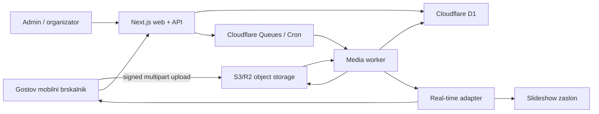

# Načrt projekta

Status: **planning**  
Delovno ime: **Eventaj Galerija**  
Primarni stack: **Next.js na Cloudflare Workers**

## Cilj

Vzpostaviti produkcijsko pripravljeno jedro, v katerem organizator prek Stripe Checkout kupi dogodek in dobi svoj račun, gost pa prek QR kode v enem kliku izbere datoteke, jih zanesljivo naloži in nato vidi v galeriji skladno s pravili objave.

## Meja prvega MVP

V MVP sodijo:

- prijava administratorja;
- osnovna organizacija/tenant in uporabniške vloge;
- ustvarjanje ter urejanje dogodka;
- javna mobilna stran dogodka;
- upload več fotografij prek signed multipart uploadov;
- asinhrona izdelava thumbnaila in spletne različice;
- javna galerija in osnovna moderacija;
- stabilne QR preusmeritve;
- Stripe Checkout ter organizacijski računi;
- osnovni dashboard in audit trail.

Videi so del poslovnega MVP, vendar naj se implementirajo takoj za stabilnim slikovnim tokom. AI, slideshow, ZIP in tiskovine niso del prvega vertikalnega reza.

## Vodilna načela

1. **Upload je jedro produkta.** Najprej zanesljivost na slabem mobilnem omrežju, šele nato vizualni dodatki.
2. **Privzeto zasebno.** Originali niso javni; dostop je prek podpisanih URL-jev ali kontroliranih CDN pravil.
3. **Asinhrono po privzetem.** Procesiranje, izvozi, e-pošta in AI ne blokirajo uporabniške zahteve.
4. **Tenant od prve migracije.** Organizacijska meja je del modela, četudi je začetni tenant samo Eventaj.
5. **Zamenljivi ponudniki.** Storage, e-pošta, real-time in AI imajo notranje vmesnike.
6. **GDPR kot podatkovni življenjski cikel.** Soglasje, namen, hramba in izbris so modelirani, ne zapisani le v pravilniku.

## Sistem na eni strani

## Ključne metrike MVP

- vsaj 95 % začetih upload sej uspešno končanih brez ročnega posega;
- čas do prikaza potrditve po zaključku prenosa pod 2 s (brez čakanja na procesiranje);
- gost pride do sistemskega izbirnika datotek z enim glavnim klikom;
- nič navzkrižnega dostopa med organizacijami v avtomatiziranih testih;
- merljiv funnel `visit → upload_started → upload_completed` po access pointu;
- vse neuspele background naloge so vidne in jih je mogoče varno ponoviti.

## Dokumentirane odločitve

- [ADR-001: Next.js modularni monolit](decisions/ADR-001-nextjs-modular-monolith.md)
- [ADR-002: neposreden upload v object storage](decisions/ADR-002-direct-object-storage-upload.md)
- [ADR-003: ločen BullMQ worker](decisions/ADR-003-background-worker.md)
- [ADR-004: Cloudflare platforma za prvi MVP](decisions/ADR-004-cloudflare-platform.md)
- [ADR-005: Slideshow polling adapter](decisions/ADR-005-slideshow-polling-adapter.md)
- [ADR-006: Tehnična kakovost kot javni publication gate](decisions/ADR-006-quality-publication-gate.md)
- [ADR-007: dogodkovno omejena anonimna identiteta in engagement projekcije](decisions/ADR-007-anonymous-guest-identity-engagement.md)
- [ADR-008: lokalni všečki in dogodkovni komentarji fotografij](decisions/ADR-008-gallery-likes-and-comments.md)
- [ADR-009: zanesljiva vrsta za obdelavo medijev](decisions/ADR-009-media-processing-queue.md)
- [ADR-010: ephemeral selfie search in face provider adapter](decisions/ADR-010-ephemeral-face-search.md)

## Pred začetkom kode

P0 vprašanja iz [OPEN_QUESTIONS.md](OPEN_QUESTIONS.md) morajo biti potrjena. Če odgovora ni, veljajo začasne predpostavke, označene v tem dokumentu, vendar se ponudniške integracije ne zaklenejo.
